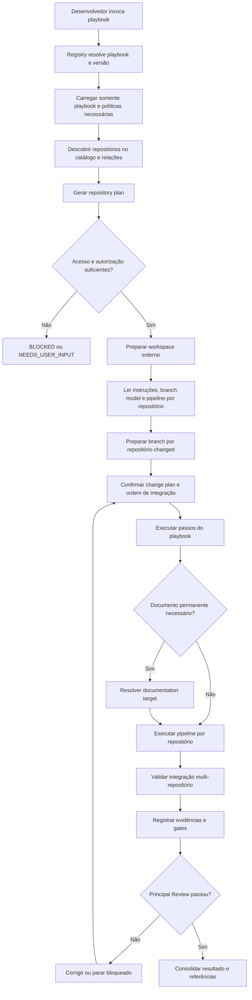

# Plano de implementação — playbooks operacionais e estrutura multi-repositório

- Status: `implemented` no template `1.2.0`
- Natureza: manutenção estrutural do produto squad-agentica; não é um delivery de projeto.
- Especificação funcional relacionada: `multi-repository-playbooks.md`
- Tipo de mudança: estrutural e reutilizável; exige nova versão da squad quando implementada e aprovada.
- Limite: este documento define a implementação; não autoriza clone, push, PR, merge, deploy ou release.

## 1. Resultado a entregar

Evoluir o template para expor exatamente oito playbooks operacionais: `/feature`, `/bugfix`, `/tests`, `/performance`, `/adr`, `/finops`, `/doc` e `/refactor`.

Ao selecionar um playbook, a squad deverá:

1. descobrir os repositórios necessários;
2. preparar um workspace externo ao template;
3. verificar acesso, remote, estado do checkout e instruções locais;
4. criar branches conforme as regras de cada repositório;
5. analisar as peças a alterar antes de escrever;
6. implementar código, infraestrutura, testes e documentação nos repositórios proprietários;
7. seguir a pipeline de cada repositório;
8. coordenar integração multi-repositório;
9. guardar em `deliveries/` somente rastreabilidade local ignorada pelo Git, nunca documentação permanente ou conteúdo promovido para release.

Não será criado um orquestrador próprio. Codex, Claude Code, Devin ou outro runtime usa seus recursos nativos de filesystem, Git, terminal, tarefas e worktrees para executar os contratos declarativos.

## 2. Arquitetura proposta



## 3. Separação de responsabilidades

| Camada | Responsabilidade | Não deve fazer |
|---|---|---|
| Playbook operacional | traduzir uma intenção cotidiana em passos e resultados | armazenar credenciais ou impor tecnologia |
| Política | impor limites universais de workspace, documentação, Git e segurança | decidir regra de negócio |
| Contrato | definir entrada/saída verificável entre etapas | executar comandos |
| Registry | resolver ID, alias, versão e arquivo do playbook | carregar todos os playbooks no contexto |
| Contexto `.project/` | configurar catálogo, documentação, branch defaults e restrições locais | enfraquecer política obrigatória |
| Runtime nativo | clonar, criar branch, editar e executar ferramentas quando autorizado | interpretar catálogo como autorização |
| Validator | conferir invariantes objetivas e referências | declarar correção semântica ou acesso real |
| Humano | decidir regras, riscos, exceções e ações externas | ser questionado sobre informação descobrível com baixo risco |

## 4. Nova estrutura de arquivos

```text
.squad/
├── playbooks/
│   ├── README.md
│   ├── feature.md
│   ├── bugfix.md
│   ├── tests.md
│   ├── performance.md
│   ├── adr.md
│   ├── finops.md
│   ├── doc.md
│   └── refactor.md
├── contracts/
│   ├── playbook.md
│   ├── playbook-result.md
│   ├── repository-workspace.md
│   ├── repository-plan.md
│   ├── documentation-target.md
│   └── multi-repository-result.md
├── policies/
│   ├── repository-workspace.md
│   └── documentation-routing.md
├── registries/
│   └── playbooks.yaml
└── templates/
    ├── playbook-result.json
    ├── repository-workspace.json
    ├── repository-plan.json
    ├── documentation-target.json
    └── multi-repository-result.json

.project/
├── project.example.yaml
└── catalog/repositories.example.yaml

scripts/
├── validate-playbooks.py
└── tests/test_playbooks.py
```

Arquivos existentes a alterar:

- `AGENTS.md`: selecionar playbook antes do workflow quando houver invocação/intenção compatível;
- `.squad/manifest.yaml`: declarar novos diretórios e arquivos obrigatórios;
- `.squad/registries/artifacts.yaml`: registrar workspace, repository plan, documentation target e playbook result;
- `.squad/policies/workflow-routing.md`: relacionar playbook principal e workflow, sem duplicar responsabilidade;
- `.squad/policies/multi-repository.md`: integrar workspace e repository plan;
- `.squad/policies/context.md`: carregar somente o playbook selecionado;
- `.squad/policies/delegation.md`: impedir que playbook seja confundido com agente/delegação;
- `.squad/policies/quality-gates.md`: exigir evidência por repositório alterado;
- workflows `feature`, `bugfix`, `architecture-review` e outros aplicáveis: aceitar playbook como entrada operacional;
- `.project/project.example.yaml`: configurar workspace, branching, documentação e delivery records;
- `.project/catalog/repositories.example.yaml`: suportar `type: documentation` e metadados operacionais;
- `start.md`: explicar invocação curta e fluxo multi-repositório;
- `README.md`: apresentar catálogo de playbooks;
- `squad.yaml` e `CHANGELOG.md`: nova versão estrutural somente na entrega aprovada.

## 5. Contrato canônico de playbook

Arquivo Markdown com front matter YAML no subset suportado pelo template:

```yaml
---
schema_version: "1.0"
id: bugfix
version: "1.0"
aliases: [fix]
summary: Investigar e corrigir um defeito reproduzível
workflow: bugfix
side_effect_class: repository-write
arguments:
  required: [objective]
  optional: [repository, symptoms, expected_behavior, flags]
permissions:
  requires_repository_read: true
  may_write_files: true
  may_create_local_branch: true
  may_push: false
  may_merge: false
  may_deploy: false
loads:
  policies: [change-impact, repository-workspace, pipeline-alignment]
outputs: [playbook-result, repository-plan, evidence]
---
```

Seções Markdown obrigatórias:

```text
Purpose
When to use
Do not use when
Inputs and autonomous discovery
Blocking questions
Preconditions
Operational steps
Semantic decisions
Deterministic checks
Failure, cancellation and recovery
Outputs and evidence
Completion criteria
```

### Invariantes

- `id`, `version` e aliases são únicos no registry;
- workflow referenciado existe;
- policies e outputs referenciados existem;
- efeitos e permissões são explícitos;
- playbook read-only não pode declarar escrita;
- playbook de escrita exige change plan e repository plan;
- `may_push`, `may_merge` e `may_deploy` são `false` nos playbooks distribuídos;
- playbook não define stack fixa;
- texto completo é carregado somente quando o playbook é selecionado.

## 6. Registry de playbooks

`.squad/registries/playbooks.yaml`:

```yaml
schema_version: "1.0"
playbooks:
  - id: feature
    version: "1.0"
    aliases: [feat]
    path: .squad/playbooks/feature.md
    workflow: feature
    intent_classes: [new-capability, functional-change]
    side_effect_class: repository-write
  - id: finops
    version: "1.0"
    aliases: [cost]
    path: .squad/playbooks/finops.md
    workflow: performance-audit
    intent_classes: [cost-analysis, cost-optimization]
    side_effect_class: conditional-write
```

O roteamento usa primeiro invocação explícita, depois regra objetiva e só então classificação semântica. Conflito material entre playbooks exige uma pergunta curta. Um único playbook é principal; outros podem ser capacidades auxiliares registradas no resultado.

## 7. Configuração ativa do projeto

Extensão proposta de `.project/project.yaml`:

```yaml
project:
  workspace:
    layout: sibling-directories
    checkout_root: runtime-managed
    allow_reuse_clean_checkout: true

  branching:
    preferred_base: develop
    feature_pattern: feature/{demand_id}-{slug}
    repository_rules_take_precedence: true

  documentation:
    repository_id: engineering-docs # opcional
    fallback_root: docs
    adr_path: docs/architecture/decisions
    operations_path: docs/operations
    development_path: docs/development

  delivery_records:
    path: deliveries
    git_ignored: true
```

`checkout_root: runtime-managed` não é um caminho real; instrui o runtime a escolher uma área segura fora do template. Caminhos absolutos e credenciais não devem ser versionados na configuração.

## 8. Catálogo de repositórios

Adicionar campos ao registro:

```yaml
repositories:
  - id: engineering-docs
    name: engineering-docs
    url: https://scm.example/org/engineering-docs
    type: documentation
    owner: architecture-platform
    systems: [shared-engineering]
    local_instructions: AGENTS.md
    default_branch: develop
    documentation_role: canonical-shared
    access_expectation: read-write-requested
    metadata_source: service-catalog
    last_verified: "2026-08-30"
```

`access_expectation` descreve expectativa, não comprova acesso nem autoriza escrita. O runtime verifica acesso antes do clone e write boundary antes da branch.

Tipos canônicos devem incluir: `application`, `service`, `frontend`, `mobile`, `library`, `infrastructure`, `configuration`, `test`, `observability`, `data`, `documentation` e `mainframe`.

## 9. Repository workspace

### Política

O checkout da squad nunca recebe clones de produto. O runtime cria um workspace externo por demanda ou reutiliza checkouts explicitamente seguros.

### Manifesto

```yaml
schema_version: "1.0"
demand_id: DEM-123
workspace_id: WS-DEM-123
root_kind: runtime-managed
repositories:
  - repository_id: customer-api
    remote_url: https://scm.example/org/customer-api
    checkout_state: reused
    local_path_ref: runtime-private
    access: verified
    head_before: abc123
    dirty_before: false
    instructions_loaded: [AGENTS.md]
```

Não persistir caminho privado quando desnecessário; usar referência opaca se o runtime puder resolver. Nunca persistir token, chave ou URL com credencial.

### Preparação segura

1. validar que o destino não está dentro do template;
2. confirmar remote esperado;
3. detectar checkout/worktree existente;
4. detectar alterações desconhecidas ou operação Git em andamento;
5. buscar refs sem sobrescrever o checkout;
6. ler instruções locais;
7. registrar revisão inicial;
8. parar diante de acesso ausente, remote divergente ou estado sujo não pertencente à demanda.

## 10. Repository plan por demanda

```yaml
repository_id: customer-api
classification: changed
reason: implementa regra e contrato HTTP
owner: customer-platform
remote_verified: true
write_authorized: true
base_branch: develop
base_revision: abc123
working_branch: feature/DEM-123-block-cancelled-contracts
planned_paths: [src/, tests/, docs/]
interfaces: [api:contract-query-v1]
pipeline:
  definition: .github/workflows/validate.yml
  required_stages: [build, unit, contract-tests]
  local_commands: [./gradlew test]
  remote_only: [integration-environment]
integration_order: 2
rollback: revert branch/commit before merge
```

Todo repositório `changed` exige owner, base/revisão, branch ou exceção documentada, write boundary, pipeline disposition, integração e rollback. `affected` pode permanecer read-only, mas precisa de verificação ou follow-up explícito.

## 11. Branches multi-repositório

Para cada repositório alterado:

1. ler regras locais e proteção de branch;
2. descobrir a base correta;
3. confirmar que a revisão base está disponível;
4. propor nome usando a regra local;
5. usar `feature/<demand-id>-<slug>` sobre `develop` apenas quando permitido;
6. criar branch local sem push automático;
7. registrar base, branch e desvio do default.

Uma demanda pode usar nomes equivalentes em vários repositórios, mas cada branch possui revisão e lifecycle próprios. Falha num repositório não pode ser escondida pelo sucesso dos demais.

## 12. Roteamento documental

Adicionar `.squad/policies/documentation-routing.md` com esta ordem:

1. convenção local do repositório proprietário;
2. repositório documental configurado para documento compartilhado/transversal;
3. fallback `docs/` no repositório proprietário;
4. ADR sem convenção: `docs/architecture/decisions/`;
5. links nos repositórios afetados quando facilitarem descoberta, sem duplicar conteúdo.

Contrato `documentation-target`:

```yaml
document_id: ADR-0042
kind: adr
scope: cross-application
owner_repository_id: customer-platform
target_repository_id: engineering-docs
target_path: docs/architecture/decisions/ADR-0042-cache.md
status: proposed
routing_reason: configured canonical documentation repository
fallback_used: false
delivery_reference_required: true
```

O delivery referencia o documento canônico com repositório, caminho, branch/revisão e status. Validação estrutural deve impedir `complete` quando documento permanente obrigatório existe somente em `deliveries/`.

## 13. Execução dos oito playbooks

### `/feature`

Sequência: requisitos → impacto → design proporcional → implementação → `/tests` e `/doc` quando aplicáveis → pipelines → integração → gates/review.

### `/bugfix`

Sequência: sintomas → reprodução → hipóteses → evidência causal → regressão → correção mínima → regressão/pipeline → review.

### `/tests`

Sequência: risco/requisito → localizar test owner/repository → escolher nível → preparar ambiente/dados/oráculo → implementar → executar → distinguir pass/fail/flaky/blocked → evidência.

### `/performance`

Sequência: definir métrica/unidade/percentil/ambiente/workload → baseline → localizar gargalo → hipótese → mudança candidata → repetir cenário comparável → reportar variabilidade e limitações.

### `/adr`

Sequência: pergunta → contexto/evidência → alternativas incluindo manter estado atual → decisão `proposed` → consequências → target canônico → índice → aprovação humana.

### `/finops`

Sequência: fonte/período/moeda/escopo → baseline e drivers → alternativas → estimativa com premissas → proteção de SLA/qualidade → mudança autorizada → janela de verificação. Economia estimada nunca é reportada como realizada.

### `/doc`

Sequência: tipo/público/owner → fonte de verdade → target canônico → conteúdo sustentado → validar links/exemplos/comandos → índice → referência no delivery.

### `/refactor`

Sequência: problema estrutural → benefício → invariantes e escopo proibido → baseline/testes de caracterização → mudanças pequenas → regressão/contratos → separar qualquer mudança funcional.

## 14. Integração multi-repositório

Contrato `multi-repository-result` deve registrar:

```yaml
demand_id: DEM-123
repositories:
  - id: customer-api
    branch: feature/DEM-123-block-cancelled
    revision: def456
    result: verified
    evidence: [EV-API-TEST]
  - id: integration-tests
    branch: feature/DEM-123-block-cancelled
    revision: 789abc
    result: verified
    evidence: [EV-E2E]
integration:
  strategy: backward-compatible-contract-first
  order: [customer-api, integration-tests]
  cross_repository_checks: [contract-suite]
  unresolved: []
```

O plano deve tratar compatibilidade forward/backward, contratos temporários, ordem de PR/merge/deploy e rollback independente. Não presumir transação atômica entre Git repositories.

## 15. Validador

Criar `scripts/validate-playbooks.py` usando dependências já aceitas pelo projeto ou stdlib quando suficiente.

### Escopo objetivo

- registry contém exatamente `feature`, `bugfix`, `tests`, `performance`, `adr`, `finops`, `doc` e `refactor` nesta versão;
- registry, IDs, aliases, versões e paths;
- front matter e seções obrigatórias;
- referências a workflow/policy/artifact existentes;
- coerência entre efeito e permissões;
- defaults perigosos proibidos;
- configuração/catálogo no subset suportado;
- repository plans e documentation targets retidos;
- estado completo sem repositório obrigatório falho/parcial;
- documentação permanente fora de `deliveries/`.
- presença de baseline/cenário comparável em resultados de `/performance`;
- fonte, período, moeda, premissas e proteção de SLA/qualidade em resultados de `/finops`.

### Fora da capacidade do validator

- comprovar que credencial funciona;
- decidir owner correto sem fonte;
- provar correção semântica;
- provar que pipeline remota passou sem evidência externa;
- verificar autorização humana não registrada;
- medir qualidade, tokens ou custo sem execução.

## 16. Testes obrigatórios

### Positivos

1. `/feature` em um único repositório com branch/pipeline/`/tests`/`/doc`.
2. `/feature` envolvendo aplicação, infra e testes.
3. `/bugfix` com reprodução e regressão.
4. `/tests` em repositório separado.
5. `/performance` com baseline comparável.
6. `/adr` permanecendo `proposed`.
7. `/finops` com fonte/período/moeda e proteção de SLA.
8. `/doc` com repositório documental e com fallback `docs/`.
9. `/refactor` preservando invariantes.
10. repositório sem `develop` seguindo regra local.

### Adversariais

1. alias duplicado;
2. playbook referenciando workflow inexistente;
3. read-only declarando escrita;
4. `may_deploy: true` no template distribuído;
5. checkout dentro do repositório da squad;
6. remote divergente;
7. checkout sujo reutilizado silenciosamente;
8. repositório `changed` sem branch/base/write boundary;
9. pipeline obrigatória omitida;
10. documentação permanente somente em `deliveries/`;
11. ADR `accepted` sem owner/review;
12. entrega completa com repositório `failed`, `partial` ou `blocked`;
13. catálogo indicando acesso tratado como autorização;
14. clone/push/retry repetido após efeito colateral desconhecido.
15. `/performance` concluindo melhoria sem baseline equivalente;
16. `/finops` sem fonte/período/moeda ou reduzindo SLA silenciosamente;
17. `/refactor` incluindo mudança funcional não declarada;
18. `/doc` mantendo documento permanente somente em `deliveries/`.

## 17. Atualização do `start.md`

Adicionar:

1. tabela de comandos cotidianos;
2. exemplos mínimos dos oito playbooks públicos;
3. explicação de que o runtime clona repositórios fora da squad;
4. fluxo Mermaid desta especificação;
5. regras de documentação e fallback `docs/`;
6. exemplo multi-repositório aplicação + infra + testes;
7. estados `BLOCKED`/`NEEDS_USER_INPUT`;
8. distinção entre branch local, push, PR, merge, deploy e release.

## 18. Compatibilidade e migração

- Workflows existentes continuam válidos sem invocação de playbook.
- Playbook é uma camada operacional sobre workflow, não substituição imediata.
- Projetos sem configuração nova usam defaults seguros: workspace gerenciado, regras locais obrigatórias, nenhum repositório documental presumido e fallback `docs/` somente após identificar proprietário.
- Campos novos começam opcionais no modo template e tornam-se obrigatórios quando a funcionalidade correspondente é ativada no modo active.
- Não migrar automaticamente documentos existentes em `deliveries/`; criar relatório e solicitar decisão sobre promoção.
- Manter IDs/aliases versionados para não quebrar prompts/scripts dos adotantes.

## 19. Fases de implementação

### Fase 1 — fundação

- contrato/registry de playbooks;
- policy de workspace e documentação;
- contratos/templates de repository plan e documentation target;
- extensão do catálogo/configuração;
- validator inicial.

### Fase 2 — implementação funcional

- `/feature`, `/bugfix`, `/tests` e `/refactor`;
- `/doc` e `/adr`;
- `/performance` e `/finops` após contratos de baseline/medição;
- integração aos workflows e `start.md`.

### Fase 3 — multi-repositório

- manifesto de workspace;
- branch por repositório;
- resultado/integracão consolidada;
- false-complete checks.

### Fase 4 — evals e piloto

- corpus positivo/adversarial `specification_only`;
- piloto pequeno aplicação + testes, sem produção;
- baseline com e sem playbook sob mesmas condições;
- decisão humana sobre evolução do catálogo baseada em frequência e resultado; esta versão não inclui playbooks públicos adicionais.

## 20. Gates aplicáveis

- Requirement: comandos e saídas atendem casos cotidianos.
- Context: configuração e catálogo são suficientes sem preload excessivo.
- Architecture: playbook/workflow/policy/runtime têm responsabilidades não duplicadas.
- Security: clone, credenciais, Git e ações externas são limitados.
- Quality: schemas, referências e casos adversariais passam.
- Platform: pipelines locais/remotas são distinguidas corretamente.
- Principal Review: revisão independente do bundle e contraexemplos.
- Delivery: documentação, testes, versão/changelog e riscos estão resolvidos.

Production Readiness, Data, Performance, Accessibility, Compliance e outros gates são condicionais conforme os playbooks/artefatos efetivamente alterados, não automaticamente aplicáveis só porque existem.

## 21. Critérios de conclusão

Implementação somente poderá ser marcada `complete` quando:

- os oito playbooks estiverem registrados, validados e documentados;
- configuração ativa e catálogo suportarem workspace/documentação;
- cada repositório alterado exigir repository plan verificável;
- documentação permanente tiver target canônico;
- `start.md` mostrar o fluxo real;
- testes positivos/adversariais passarem;
- nenhuma ação externa for autorizada implicitamente;
- Principal Review independente passar;
- limitações operacionais e ausência/presença de piloto estiverem explícitas.

## 22. Métricas do piloto

Comparar sem/com playbook usando a mesma demanda, runtime, modelo, ferramentas, revisão e orçamento:

- caracteres/palavras digitados pelo desenvolvedor;
- tempo até plano executável;
- completude de passos obrigatórios;
- perguntas desnecessárias e bloqueantes corretas;
- repositórios omitidos ou incluídos sem necessidade;
- erros de branch, documentação e pipeline;
- taxa de sucesso e intervenção humana;
- tokens de entrada/saída, custo e latência reportados pelo runtime.

Não usar estimativa de bytes como tokens reais. Uma redução de digitação/contexto só é melhoria se qualidade e segurança permanecerem dentro dos critérios definidos.

## 23. Decisões humanas obrigatórias

- write scope e repositórios autorizados;
- fonte de verdade documental e owner;
- regra de negócio ambígua;
- aprovação de ADR;
- exceção de branch/pipeline;
- segredo, dado regulado ou produção;
- push, PR, merge, deploy e release;
- rollout irreversível ou compromisso de custo/SLA.

## 24. Fora de escopo

- desenvolver orquestrador, servidor ou gerenciador de credenciais;
- escolher fornecedor de Git/CI;
- impor GitFlow a todos os projetos;
- criar playbook por linguagem;
- clonar ou modificar repositórios externos nesta fase documental;
- afirmar economia ou precisão sem piloto comparável.
