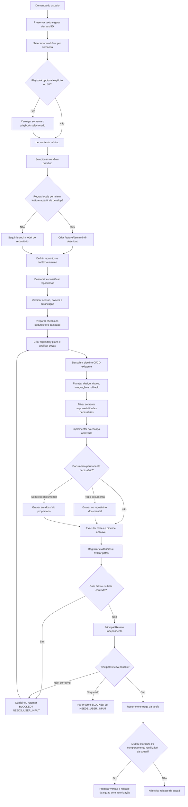

# Começando com a squad agêntica

Este repositório fornece um modelo operacional documentation-first. Ele não inicia um servidor nem implementa um orquestrador: Codex, Claude Code, Devin ou outro runtime executa o trabalho seguindo `AGENTS.md`, enquanto `.squad/` define o comportamento reutilizável e `.project/` fornece o contexto real do projeto.

## Pré-requisitos e precedência

1. Abra o repositório no runtime de desenvolvimento e confirme que ele carrega `AGENTS.md`.
2. Preserve as regras locais do projeto. Instruções de branch, build, teste, revisão e pipeline podem ser mais estritas que este template, mas não podem enfraquecer suas políticas universais obrigatórias.
3. Não trate os arquivos atuais de `.project/` como fatos: eles são exemplos e precisam ser substituídos antes do uso ativo.
4. Não copie segredos, dados produtivos, payloads regulados ou repositórios inteiros para prompts/contexto.

## 1. Prepare a documentação de um projeto existente

Crie `.project/project.yaml` a partir de `.project/project.example.yaml`, use `status: active` e registre `context_owner` e `last_reviewed`. Em `squad.yaml`, altere `spec.adoption.mode` para `active` e `project_config` para `.project/project.yaml`.

Substitua os exemplos por informação revisada e indique fonte, owner e data de revisão:

| Arquivo | Conteúdo necessário |
|---|---|
| `.project/context.md` | missão, domínios, jornadas críticas e limites do projeto |
| `.project/technology-stack.md` | linguagens, frameworks, runtimes, bancos, infraestrutura e ferramentas realmente observados |
| `.project/architecture.md` e `domain-rules.md` | fronteiras, contratos, regras de negócio conhecidas e decisões vigentes |
| `.project/ownership.md` e `squad.md` | responsáveis técnicos, autoridades humanas e capacidades disponíveis |
| `.project/repositories.md` e `catalog/` | repositórios, sistemas, interfaces, relações, criticidade e classificação |
| `.project/constraints.md` | acesso, dados, segurança, custo, produção e mudança |
| `.project/quality-profile.md` | testes, required checks, critérios de qualidade e acessibilidade |
| `.project/compliance.md` e `observability.md` | controles aplicáveis, SLOs, logs, métricas, tracing e retenção |

Catalogue metadados e referências; o agente descobre o código progressivamente. Verifique a adoção ativa com:

```text
python scripts/validate-template.py --mode active
```

## Playbooks operacionais opcionais

O catálogo possui nove receitas opcionais carregadas sob demanda. Demandas em linguagem natural são roteadas diretamente ao workflow; nomes iniciados por `/` abaixo são apenas atalhos textuais de prompt, não comandos do shell/runtime.

| Comando | Resultado principal |
|---|---|
| `/feature` | funcionalidade ou mudança funcional |
| `/bugfix` | diagnóstico, causa sustentada, correção e regressão |
| `/tests` | cobertura ligada a requisito/risco |
| `technical-discovery` | comparação de alternativas sem implementar produto |
| `/performance` | baseline, experimento comparável e verificação |
| `/adr` | decisão `proposed`, alternativas e consequências |
| `/finops` | baseline de custo, alternativas e proteção de SLA/qualidade |
| `/doc` | documentação no repositório canônico ou fallback `docs/` |
| `/refactor` | estrutura melhor preservando invariantes funcionais |

Exemplo: `Use o playbook bugfix para corrigir timeout na consulta de contratos`. Também é válido referenciar `.squad/playbooks/playbook-bugfix.md` ou descrever apenas o defeito. O agente resolve o workflow, descobre repositórios, segue branches/pipelines locais e registra evidência. Repositórios de produto nunca são clonados automaticamente nem colocados dentro de `.squad/`.

## 2. Descubra a stack e componha o time

A stack deve vir de evidência do projeto: manifestos de build, arquivos de dependência, configurações de infraestrutura, catálogos, documentação vigente e inspeção dos repositórios. A stack de exemplo deste template não é uma recomendação.

Comece pelas responsabilidades mínimas:

- Lead: escopo, workflow, integração e status;
- Requirement Analyst: objetivo, critérios e perguntas bloqueantes;
- Software Engineer: implementação nas peças realmente afetadas;
- Quality Engineer: estratégia, testes e evidência;
- Principal Reviewer: revisão final independente.

Ative responsabilidades adicionais somente pelo impacto da demanda:

| Evidência de impacto | Responsabilidade candidata |
|---|---|
| novo contrato, fronteira ou decisão difícil de reverter | Solution Architect |
| identidade, segredo, entrada não confiável ou dado sensível | Security Engineer |
| deploy, SLO, observabilidade, recuperação ou produção | Reliability Engineer |
| schema, dataset, pipeline de dados ou retenção | Data Engineer |
| latência, capacidade, tráfego ou custo material | Performance Engineer |
| CI/CD, cloud, IaC ou configuração compartilhada | Platform Engineer |
| interface de usuário | Quality com acessibilidade aplicável |

A presença de uma tecnologia, isoladamente, não justifica criar outro agente.

## 3. Inicie uma tarefa com segurança

Leia primeiro as regras de branch do repositório. Quando o projeto usar `develop` e permitir esse modelo, crie uma branch dedicada:

```text
git switch develop
git pull --ff-only
git switch -c feature/<demand-id>-<descricao-curta>
```

Essa é uma recomendação, não uma autorização para ignorar GitFlow, trunk-based development, release trains, hotfixes ou políticas protegidas do projeto. Registre qualquer desvio no change plan. Push, merge, deploy e release exigem suas próprias autorizações.

Depois preserve a demanda, gere um demand ID, selecione o workflow e use o diretório privado do projeto em `TEAMFLOW_HOME/teams/<team-id>/projects/<project-id>/deliveries/<demand-id>/`.

## 4. Analise o que precisará mudar antes de implementar

Antes de design, delegação ou escrita, produza `change-impact.md` com base no [contrato de change plan](.squad/contracts/change-plan.md). Identifique:

- sistemas, repositórios, componentes, arquivos e owners;
- contratos, APIs, eventos, schemas, dados e consumidores;
- configuração, infraestrutura e observabilidade;
- testes, documentação e evidências necessárias;
- branch, pipeline, integração/merge, rollout e rollback;
- peças apenas observadas, afetadas, realmente alteradas ou deixadas como follow-up;
- desconhecidos e decisões que exigem uma pessoa.

Esse passo agora é obrigatório. O mapa pode evoluir quando novas evidências surgirem, mas a implementação não pode expandir o escopo silenciosamente.

## 5. Descubra e siga a pipeline existente

Procure `AGENTS.md`, `README`, `CONTRIBUTING`, scripts de build e definições como `.github/workflows/`, `.gitlab-ci.yml`, `azure-pipelines.yml`, `Jenkinsfile` ou sistemas externos documentados.

Registre no change plan:

- estágios e required checks aplicáveis às peças alteradas;
- comandos locais equivalentes e ambiente/dados necessários;
- checks que só a CI ou ambiente protegido pode executar;
- owners, aprovações e evidências esperadas.

Execute localmente apenas o que for seguro e autorizado. A pipeline oficial continua sendo a fonte de verdade; não declare que um check remoto passou quando apenas uma aproximação local foi executada. Se nenhuma pipeline for encontrada, registre onde procurou e defina verificações proporcionais com base na documentação disponível.

## 6. Rode o primeiro projeto

Escolha um piloto pequeno, reversível, de um único repositório e com critério de sucesso observável. Evite começar por produção, migração irreversível ou mudança regulada.

1. Prepare `.project/` e valide em modo `active`.
2. Escolha a demanda piloto e crie a branch permitida pelo projeto.
3. Envie o prompt abaixo.
4. Revise requisitos, contexto e change impact antes de autorizar implementação.
5. Deixe o agente implementar somente as peças aprovadas.
6. Execute testes e os estágios aplicáveis da pipeline.
7. Confira evidências, gates, revisão principal e resumo no diretório privado `TEAMFLOW_HOME/teams/<team-id>/projects/<project-id>/deliveries/<demand-id>/`.
8. Registre tokens, custo e latência somente se o runtime fornecer esses valores; compare qualidade antes de concluir que houve melhoria.

## Prompt de exemplo

```text
Siga o AGENTS.md e as regras locais dos repositórios.

Demanda: [descreva o resultado desejado e os critérios conhecidos].

Antes de implementar:
1. preserve a demanda e gere um demand ID;
2. selecione o workflow adequado;
3. carregue somente o contexto necessário;
4. produza uma análise de impacto com sistemas, repositórios, arquivos,
   contratos, dados, testes, documentação, observabilidade e pipeline
   possivelmente afetados;
5. descubra e siga a CI/CD existente;
6. se as regras locais permitirem, use uma branch
   feature/<demand-id>-<descricao-curta> criada a partir de develop.

Registre artefatos e evidências somente em TEAMFLOW_HOME/teams/<team-id>/projects/<project-id>/deliveries/<demand-id>/. Pare com
NEEDS_USER_INPUT ou BLOCKED se faltar regra de negócio, acesso, autorização,
evidência obrigatória ou se uma decisão material não puder ser descoberta.
Não faça push, merge, deploy, release ou ação destrutiva sem autorização explícita.
```

## Fluxo da squad



## Exemplo multi-repositório: aplicação, infraestrutura e testes

Uma feature que adiciona uma fila pode envolver `customer-api` (contrato e produtor), `customer-infra` (fila e permissões) e `customer-tests` (contrato e jornada). O agente cria um `repository-plan` por repositório, cada um com remote verificado, owner, base/revisão, branch, limites de escrita e pipeline. Uma ordem possível é infraestrutura compatível primeiro, aplicação depois e testes por último; ela só é adotada após verificar contratos, rollback e regras locais. Sucesso em dois repositórios não oculta falha no terceiro, e nenhuma branch é publicada automaticamente.

Documentação transversal vai ao repositório com `documentation_role: canonical-shared`. Sem esse repositório, vai a `docs/` do repositório proprietário. `deliveries/` guarda somente registros locais privados em `TEAMFLOW_HOME`, nunca no checkout deste template ou do produto.

## Quando criar uma release

Crie uma release versionada deste template somente quando a entrega alterar sua estrutura reutilizável, comportamento normativo ou contratos — por exemplo `AGENTS.md`, `.squad/`, `squad.yaml` ou validators que definem conformidade.

Uma tarefa comum de produto, uma alteração de contexto local em `.project/` ou artefatos em `deliveries/` não cria uma release da squad. Release ou deploy da aplicação é outro processo e segue exclusivamente a pipeline, regras locais e autoridades do projeto. A preparação usa `release/<version>` e a publicação usa uma tag anotada `v<version>`; preparar a versão não autoriza publicar tag ou release.

## Checklist da primeira execução

- [ ] `.project/project.yaml` está ativo, possui owner/data e referencia caminhos reais.
- [ ] A stack foi descoberta por fontes do projeto, não copiada do exemplo.
- [ ] O runtime lê `AGENTS.md`.
- [ ] Branch e pipeline locais foram descobertas antes da implementação.
- [ ] `change-impact.md` identifica peças, testes, integração e write boundary.
- [ ] A demanda piloto é pequena, reversível e possui critério observável.
- [ ] Testes/pipeline produziram evidência sem extrapolar checks não executados.
- [ ] Gates aplicáveis e Principal Review estão resolvidos.

Continue em [adoção](docs/adoption.md), [arquitetura](docs/architecture.md), [uso com runtimes](docs/using-with-runtimes.md) e [multi-repositório](docs/multi-repository-estates.md).
